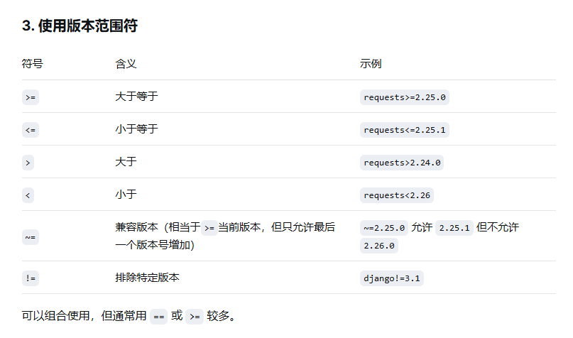

# code学习记录

当前服务器密码:

LaiHongTao123

---

## 3.10号

重装了我的服务器

安装了tmux，swap，docker

tmux主要是用来保存会话记录的，防止突然的服务器断联然后重回时消息记录没了

swap的作用主要是扩内存，主要原理就是拿硬盘的一部分来充当内存，但其速率远远小于真内存，仅防止突然的内存溢出

docker容器沙盒，主要作用是隔离各个工作空间的

```bash
# 启动一个新会话，名称为 my_session
tmux new -s my_session
# 在当前会话中创建新窗口
Ctrl-b c
# 水平分割当前窗格
Ctrl-b %
# 垂直分割当前窗格
Ctrl-b "
# 在窗格之间切换
Ctrl-b 方向键
# 分离当前会话（保持后台运行）
Ctrl-b d
# 列出所有会话
tmux ls
# 重新附着到会话 my_session
tmux attach -t my_session
# 关闭当前窗格或窗口（直接输入 exit 或按 Ctrl-d）
exit
```

---

## 3.12

在本机上制作了三个文件分别为

[main.py](http://main.py)     requirements.txt     dockerfile

[main.py](http://main.py)主要作用是发送内容给网页

requirements.txt主要作用是用来告诉启动程序，这个程序主要是需要什么内容库（ requirements是py库的写法，其他语言也有类似的txt文件但前缀不一）



dockerfile这个文件就是告诉docker，我们启动沙盒主要需要什么功能什么导向

scp .\[main.py](http://main.py) .\requirements.txt .\Dockerfile root@108.187.15.71:~/my_first_api/

这个代码主要是用来传输我们那三个文件到我们服务器指定的文件夹的

打开cmd用shell来发送比较方便，原来的cmd有点白痴

scp xx（打出文件名Tap就好了）用户名@服务器ip:~/项目文件地址


---

## 3.13

写了个docker-compose.yml

```
version: '3.8'

services:
  # 服务1：你的 FastAPI 后端
  web:
    build: .          # 告诉 docker-compose，去当前目录找 Dockerfile 现场打包镜像
    container_name: agent_api
    ports:
      - "8000:8000"   # 暴露给外网的端口
    depends_on:
      - db            # 核心逻辑：告诉系统，必须等数据库 db 启动了，才能启动 web

  # 服务2：MySQL 8.0 数据库
  db:
    image: mysql:8.0  # 直接拉取官方做好的纯净版 MySQL 8.0 镜像
    container_name: agent_mysql
    ports:
      - "3306:3306"   # 为了你后续在本地用 Navicat 连服务器查数据，先把 3306 暴露出来
    environment:
      MYSQL_ROOT_PASSWORD: "ddac#af**%3"  # 数据库的 Root 密码，严禁改得太简单
      MYSQL_DATABASE: agent_db     # 启动时自动
      
      创建一个名为 agent_db 的空库
    volumes:
      - mysql_data:/var/lib/mysql    # 核心防御：数据持久化。如果不写这个，容器一重启，你存的数据就全丢了！

# 声明需要用到的硬盘卷
volumes:
  mysql_data:
```

按我的理解来讲一遍代码

version 这个就是指定版本，docker-compose有好多版本

services：就是告诉服务要用到的东西
web：和db 一个指网页一个指数据库的配置

build: . 这段说他要开始构筑，默认情况下Docker会在构建上下文中找“Dockerfile”，而“ . ”点就是说在这个文件夹底下找到“Dockerfile”，然后发送到Docker守护进程

container_name:agent_mysql 意思就是这个定义这个沙箱的名称为 agent_mysql

ports:  这个就是设置端口   “-”号在YAML语法短横线表示列表项（数组元素）的开始，主要告诉解析器后面的这个值属于一个列表，列表的一个条目

要是想映射多个端口就这样写法

```yaml
ports:
	- "8000:8000" # 第一个端口映射
	- "3306:3306" # 第二个端口映射
```

“3306:3306”这个就表示宿主机端口:容器端口的映射,左边对外，右边对内。右边3306是MySQL的默认端口，左边的是外部过来访问3306这个端口。要是左边的3306端口被占用了，用其他端口都可以，这是左边映射右边的结果

environment:
      MYSQL_ROOT_PASSWORD: "ddac#af**%3"  
      MYSQL_DATABASE: agent_db

environment: 向容器内部传递环境变量，就像后面那俩行告诉容器数据库的密码和database的名称，也可在加其他变量

volumes:
      - mysql_data:/var/lib/mysql

volumes:声明命名卷，类似创建变量，下方则是告诉‘docker’数据存放的地址

最下面的这个

```yaml
# 声明需要用到的硬盘卷
volumes:
  mysql_data:
```

外部声明 = 准备一个保险箱（命名卷），告诉 Docker 你要用这个保险箱。

内部声明 = 告诉容器：“把你重要的文件（数据库数据）放进这个保险箱里”。

容器只负责放文件，保险箱由 Docker 保管。
（这个deepseek讲的很清晰了，就不做理解更改贴上来了）

3.17

docker run -it --name work2 -v "C:\Users\90348\Documents\GitHub\aewcy-Practice:/workspace" -w /workspace python:3.11-slim bash  

C:\Users\90348\Documents\GitHub\aewcy-Practice

在本机上创建一个沙箱环境，需要先去网站上下载docker
[Docker Desktop](https://www.docker.com/products/docker-desktop/)


在登陆完成后就去cmd打开shell上准备配置沙盒

docker run 

-it --name work2 

-v "C:\Users\90348\Documents\GitHub\aewcy-Practice:/workspace" 

-w /workspace python:3.11-slim bash  

代码分为四个部分

docker run是启动容器 ， -it是-i和-t的结合，分别代表的是保持容器的标准输入和为容器分配一个伪终端。—name work1 为容器命名为work1

-v 挂载卷，看代码就是把本地指定路径的文件挂在到容器卷，以方便外部文件变化时能够同步给容器内的镜像文件

-w 是workdir，指定工作文件，因为我们指定挂载卷是/workspace所以我们在这个文件操作，后面的py是选编译器镜像以让容器能够顺利运行代码，bash指定文件运行后移动shell

3.18

```python
def create_access_token(data:dict , expires_delta:timedelta | None = None):
    to_encode = data.copy()
    if expires_delta:
        expire = datatime.now(timezone.utc) + expires_delta
    else:
        expire = datatime.now(timezone.utc) + timedelta(minutes=ACCESS_TOKEN_EXPIRE_MINUTES)
    to_encode.update({"exp": expire})
    encoded_jwt = jwt.encode(to_encode, SECRET_KEY, algorithm=ALGORITHM)
    return encoded_jwt

```

制作jwt认证， 主要是验证用户密码并返回jwt认证信息

def create_access_token(data:dict , expires_delta:timedelta | None = None):

data为变量名，dict是字典传信息给data    第二个就是拿取过期时间，jwt鉴权只要是用来验证用户的，但不能永久验证，账户他会有注销，封禁等非正常状态。若jwt鉴权永久，会导致服务器风险增加

to_encode = data.copy()

复制一遍输入参数，防止因操作导致的修改会导致报错

if判断，在前面def 如果传过来的过期时间是none，none不能参与运算，会报错。这个主要是给过期时间。

to_encode.update({”exp”:expire})

这个是时把exp的键值也传给to_encod，也就是to_encod有了({”data”:dict} , {”exp”:expire})

encoded_jwt = jwt.encode(to_encode, SECRET_KEY, algorithm=ALGORITHM)

这个就是把jwt,encode运算完里面三个参数赋值给encoded_jwt，三个信息分别是
1，用户名和密码，过期时间

2，私钥

3，加密算法

然后return返回值

```python

def credentials_exception():
    credentials_exception = HTTPException(
        status_code = 401,
        detail = "密码/用户名错误",
        headers = {"WWW-Authenticate": "Bearer"},
    )
    raise credentials_exception
    
@app.post("/login")
def login(form_data: OAuth2PasswordRequestForm = Depends(), db: Session = Depends(get_db)):
    # 从数据库查用户
    db_user = db.query(models.User).filter(models.User.username == form_data.username).first()
    if not db_user:
        credentials_exception()

    is_valid = security.verify_password(form_data.password, db_user.hashed_password)
    if not is_valid:
        credentials_exception()

    if not getattr(db_user,"is_active",True):
        credentials_exception()

    return {"access_token": security.create_access_token(data={"sub": db_user.username}), "token_type": "bearer"}
```

@app.post(”/login”) 把login的请求放到这个函数上

 def login(form_data: OAuth2PasswordRequestForm = Depends(), db: Session = Depends(get_db)):

form_data: OAuth2PasswordRequestForm = Depends()  作用是解析表单，将前端传回来来的表单转化成能够去调用的形式，既`username=test&password=123` 转化成{ "username": test, "password": 123 }

第一个if 主要是判断是有否注册的用户，如果时未注册的则返回异常状态码401

第二个if，主要判断密码是否正确，会先对传输进来的密码进行哈希，之后比较，若不匹配则传回异常状态码401

第三个if，主要是怕段账户是否为异常状态，比如封禁那些，如果是也抛出异常状态401